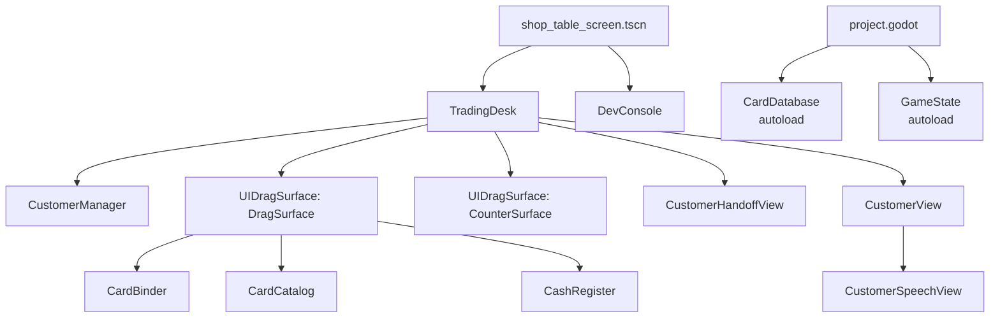
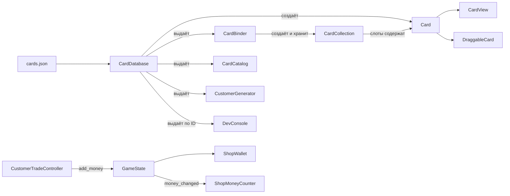
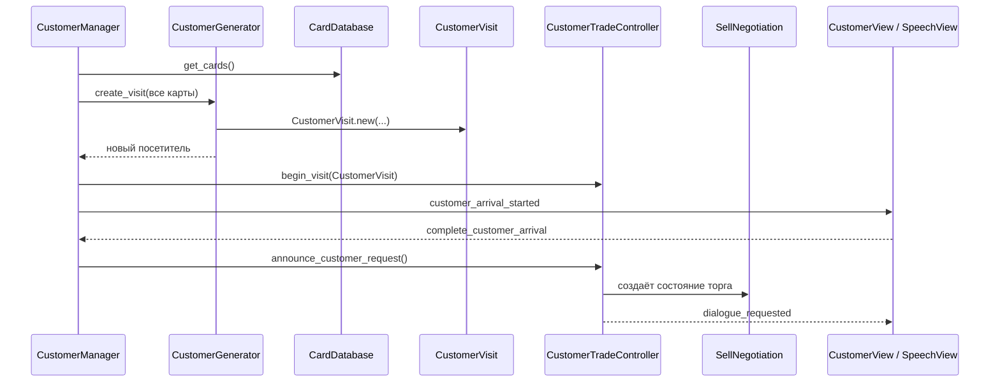
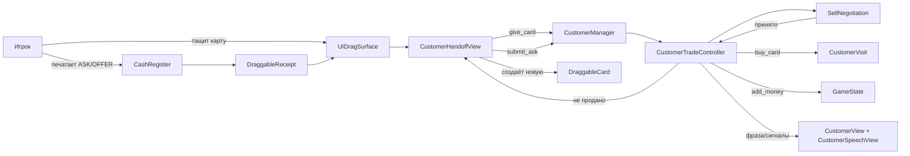
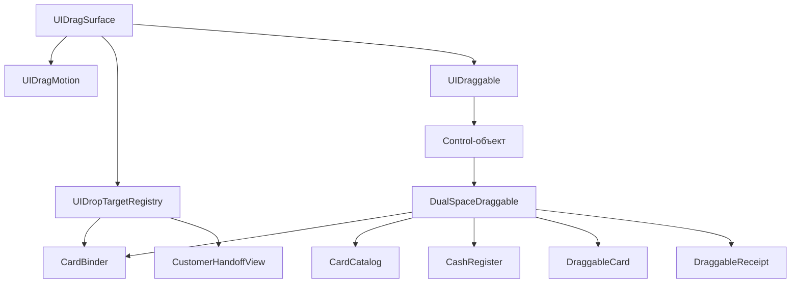

# Карта зависимостей

Это карта **реальных** зависимостей: кто создаёт объект, кто его хранит и где он применяется.

## Запуск сцены

`project.godot` запускает `scenes/screens/shop_table_screen.tscn`. Эта сцена создаёт `TradingDesk` и `DevConsole`. Две глобальные автозагрузки существуют на протяжении всей игры: `CardDatabase` и `GameState`.

## Карты и деньги

### Кто создаёт `Card`

| Создатель | Когда | Где используется |
|---|---|---|
| `CardDatabase._load_cards()` | Один раз при запуске | Каталог, альбом, генератор клиентов, консоль и визуальные карты. |

`Card` — не нода и не сцена, а объект с данными карты.

## Посетитель и торговля

### Кто создаёт `CustomerVisit`

| Создатель | Сценарий | Куда передаётся |
|---|---|---|
| `CustomerGenerator.create_visit()` | Обычный автоматический приход клиента | `CustomerManager._spawn_next_random_customer()` → `spawn_new_customer()` → `CustomerTradeController.begin_visit()`. |
| `DevConsole._customer_spawn()` | Отладочная команда ручного создания клиента | `CustomerManager.spawn_new_customer()`. |

После создания `CustomerManager` хранит его в `_current_customer`, а `CustomerTradeController` — в `_customer`, пока клиент не уйдёт.

### Кто создаёт `SellNegotiation`

| Создатель | Условие |
|---|---|
| `CustomerTradeController.begin_visit()` | Клиент заранее запросил конкретную карту. |
| `CustomerTradeController.receive_card()` | Клиент готов купить любую карту: торг начинается после передачи первой карты. |

`SellNegotiation` — только расчёт правил торговли: цена, терпение, встречные предложения и итог. Он ничего не рисует.

### Путь продажи

## Drag-and-drop

| Класс | Роль |
|---|---|
| `UIDragSurface` | Обрабатывает ввод, выбирает предмет, двигает его, передаёт между столом/прилавком и выполняет сброс. |
| `UIDraggable` | Компонент предмета: целевая позиция, скорость, тень и связь со своей поверхностью. |
| `UIDragMotion` | Математика границ, инерции, торможения и гравитации. |
| `UIDropTargetRegistry` | Список мест сброса: сейчас `CardBinder` и `CustomerHandoffView`. |
| `DualSpaceDraggable` | База объектов с разным видом на столе и прилавке. |

## Кто создаёт объекты UI

| Объект | Кто создаёт | Для чего |
|---|---|---|
| `DraggableCard` | `DevConsole`, `CardBinder`, `CustomerHandoffView` | Таскаемая карта: выдать через консоль, достать из альбома или вернуть от клиента. |
| `DraggableReceipt` | `CashRegister._print_receipt()` | Чек `ASK` или `OFFER` для клиента. |
| `CardView` | `CardBinderPreviewRenderer.render()` | Предпросмотр карты внутри слота альбома. |
| `CustomerVisit` | `CustomerGenerator` или `DevConsole` | Данные текущего посетителя. |
| `SellNegotiation` | `CustomerTradeController` | Состояние текущего торга. |
| `CardCollection` | `CardBinder._initialize_collection()` | Слоты альбома игрока. |

## Привязка к сценам

| Скрипт / класс | Где живёт |
|---|---|
| `TradingDesk`, `CustomerManager`, `CustomerView`, `CustomerSpeechView`, `CustomerHandoffView`, обе `UIDragSurface` | `scenes/gameplay/trading_desk.tscn` |
| `CardBinder`, `CardCatalog`, `CashRegister` | Отдельные сцены UI, инстанцированные в `trading_desk.tscn` |
| `DraggableCard`, `DraggableReceipt`, `DraggableGreyboxItem` | Отдельные сцены UI; создаются в рантайме или используются для теста |
| `DevConsole` | `scenes/ui/dev_console.tscn`, вставлена в `shop_table_screen.tscn` |
| `ShopMoneyCounter` | `scenes/ui/shop_money_counter.tscn`, вставлена в `shop_placeholder.tscn` |
| `CardDatabase`, `GameState` | Глобальные автозагрузки из `project.godot` |
| `Card`, `ShopWallet`, `SellNegotiation`, `CustomerVisit`, `CustomerGenerator`, `CustomerTradeController`, `CardCollection`, `UIDragMotion`, `UIDropTargetRegistry`, `CardBinderPreviewRenderer` | Вспомогательные классы, создаваемые кодом; сами в дереве сцен не существуют. |

## Главное

1. `CustomerManager` владеет жизненным циклом посетителя.
2. `CustomerTradeController` владеет сделкой.
3. `CustomerVisit` — данные клиента; его создаёт генератор или консоль.
4. `UIDragSurface` владеет жестом перетаскивания; альбом и зона клиента — только цели сброса.
