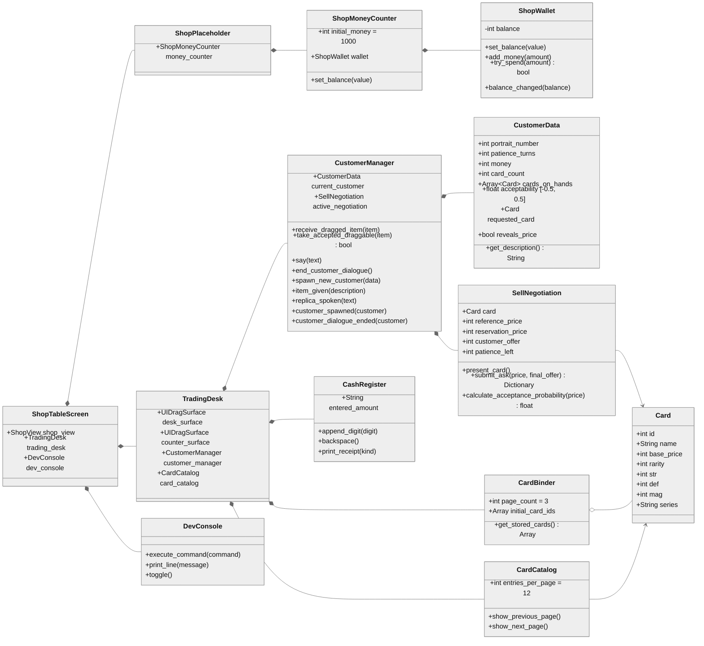
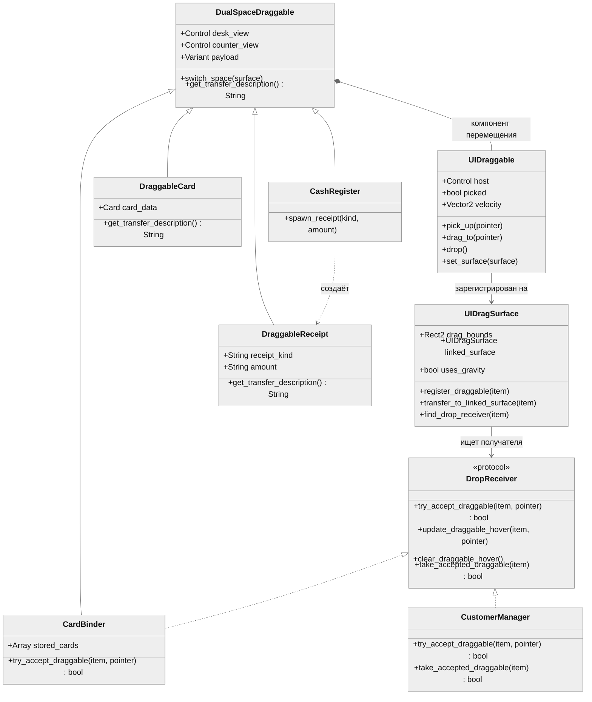

# Структура проекта

Проект — прототип магазина коллекционных карт с интерфейсом в духе *Papers, Please*. Текущая игра сосредоточена на одном экране: игрок перемещает предметы между столом и прилавком, работает с журналом карт и кассой, печатает чеки и передаёт покупателю карты или чеки.

Проект использует Godot 4.7. Стартовая сцена — `scenes/screens/shop_table_screen.tscn`, базовое разрешение — 1960 × 1080.

## Главная сцена

```text
ShopTableScreen
├── ShopView                         верхняя часть магазина
│   └── ShopMoneyCounter             баланс магазина, стартовое значение $1000
├── TradingDesk                      рабочая область
│   ├── VisitorArea
│   │   ├── Portrait                 портрет текущего покупателя
│   │   ├── HandoffLayer             падение переданных предметов за прилавком
│   │   ├── CustomerManager          данные, реплики и приём предметов
│   │   └── Counter                  визуальный прилавок
│   ├── CounterSurface               физическое пространство прилавка
│   └── DragSurface                  пространство стола
│       ├── CardBinder               журнал-инвентарь с картами
│       ├── CardCatalog              справочник «карта — каталожная цена»
│       └── CashRegister             касса
└── DevConsole                       игровая консоль, открывается клавишей `
```

`ShopView` и `TradingDesk` — отдельные сцены. Верх магазина можно развивать независимо от рабочего стола, а вся логика перемещения предметов остаётся внутри общей системы drag-and-drop.

## UML: основные игровые системы

Схема разделена на две части, чтобы связи и подписи не приходилось уменьшать. В обеих диаграммах задан шрифт 20 px.



## UML: drag-and-drop



`DropReceiver` на схеме — не отдельный GDScript-класс, а фактический протокол по именам методов. Журнал принимает предмет и позволяет поверхности удалить его сразу. `CustomerManager` реализует дополнительный `take_accepted_draggable()`, забирает ноду себе и завершает передачу асинхронно.

## Каталоги

### `assets/` — визуальный контент

- `assets/cards/` — изображения обычных, редких и специальных карт;
- `assets/portraits_new/` — активные портреты покупателей вида `Customer_00N.png`;
- `assets/portraits/` — сохранённые старые портреты и персонажи;
- `assets/ui/card_frames/` — рамки карт по редкости;
- `assets/ui/icons/` и `assets/ui/backgrounds/` — элементы интерфейса;
- `assets/fonts/` — игровые шрифты;
- `assets/story/` — сохранённые сюжетные изображения.

Файл `Customer_002_magic.png` существует как отдельный вариант, но текущий `CustomerManager` автоматически выбирает только обычный шаблон `Customer_00N.png`.

### `data/` — контентные данные

- `cards.json` — каталог карт;
- `text.json` — текст интерфейса;
- `dev_commands.json` — справка по командам игровой консоли;
- `trading_text.json` — временные короткие реплики покупателей и ответы торговли;
- `endings.json`, `events.json`, `quests.json`, `story_traders.json` и `legacy/` — сохранённый контент, который текущая главная сцена пока не загружает.

Текст и параметры карт хранятся отдельно от кода. Для нового контента следует в первую очередь дополнять JSON и изображения, а не встраивать строки в игровые скрипты.

### `scripts/core/` — загрузка и общие данные

- `game_paths.gd` — единая таблица путей к JSON и карточным ресурсам;
- `content_loader.gd` — чтение и проверка JSON;
- `globals.gd` — autoload `Globals`: загружает карты и UI-текст, строит индекс карт по ID.

### `scripts/domain/` — модели данных

- `card.gd` — данные карты и её каталожная цена; для старых записей без `price` оставлен расчётный fallback;
- `customer_data.gd` — личные данные покупателя: портрет, терпение, деньги, карты на руках, `acceptability`, желаемая карта и флаг показа цены;
- `sell_negotiation.gd` — состояние и чистые правила одной продажи: встречные цены, терпение и финальное решение;
- `shop_wallet.gd` — баланс магазина и операции пополнения/списания.

Доменные классы не отвечают за внешний вид. Они хранят состояние, которое UI отображает и изменяет.

### `scripts/gameplay/` — игровые правила

- `trading_desk.gd` — связывает стол, прилавок и менеджер покупателя;
- `customer_manager.gd` — управляет бесконечной очередью покупателей, портретами, репликами, передачей предметов и ходом продажи;
- `card_binder.gd` — страницы, слоты, hover и содержимое журнала-инвентаря;
- `card_catalog.gd` — постранично показывает названия всех карт и их каталожные цены;
- `cash_register.gd` — ввод суммы и печать чеков.

### `scripts/ui/` — представление и ввод

- `card_view.gd` — отображение полной карты;
- `draggable_card.gd` — представления карты для стола и прилавка;
- `draggable_receipt.gd` — представления чека;
- `draggable_greybox_item.gd` — тестовый переносимый предмет;
- `shop_money_counter.gd` — отображение баланса магазина;
- `dev_console.gd` — ввод, разбор и выполнение dev-команд;
- `drag_drop/ui_draggable.gd` — переиспользуемый компонент захвата и плавного движения;
- `drag_drop/ui_drag_surface.gd` — границы пространства, перенос между зонами, гравитация и горизонтальная инерция;
- `drag_drop/dual_space_draggable.gd` — базовый класс предмета с разными видами для стола и прилавка.

### `scenes/` — композиция интерфейса

- `scenes/screens/shop_table_screen.tscn` — главная и стартовая сцена;
- `scenes/gameplay/shop_placeholder.tscn` — верх магазина и счётчик денег;
- `scenes/gameplay/trading_desk.tscn` — посетитель, прилавок и обе drag-поверхности;
- `scenes/ui/card_binder.tscn` — журнал-инвентарь;
- `scenes/ui/card_catalog.tscn` — отдельная переносимая книга-каталог;
- `scenes/ui/cash_register.tscn` — касса;
- `scenes/ui/draggable_receipt.tscn` — чек;
- `scenes/ui/draggable_card.tscn` — карта;
- `scenes/ui/card_view.tscn` — полное карточное представление;
- `scenes/ui/dev_console.tscn` — игровая консоль;
- `scenes/ui/shop_money_counter.tscn` — счётчик денег;
- `scenes/ui/drag_drop/ui_draggable.tscn` — узел-компонент перетаскивания.

## Как работают ключевые системы

### Два пространства предметов

`DragSurface` представляет стол, `CounterSurface` — прилавок. Они связаны друг с другом. При пересечении границы предмет меняет родительскую поверхность и визуальное представление, но сохраняет свой payload: карта не теряет `Card`, чек — тип и сумму, журнал — содержимое.

На прилавке действуют гравитация, уровень пола и горизонтальное замедление. На столе предмет следует за курсором плавно и может частично выходить за границу поверхности, но не более разрешённой доли своего размера.

Тень создаётся компонентом `UIDraggable` только на время захвата предмета.

### Журнал карт

`CardBinder` по умолчанию содержит 3 страницы. Число страниц меняется экспортируемым свойством `page_count`.

- На странице 6 слотов: 3 столбца × 2 строки.
- `initial_card_ids` определяет стартовое наполнение.
- Карта извлекается из занятого слота как обычный `DraggableCard`.
- Карта помещается только в пустой слот, если курсор попал в центральные 50% слота по обеим координатам.
- При подходящем наведении затемняется только пустой слот; занятые слоты не подсвечиваются.
- Если условие не выполнено, карта остаётся на столе поверх журнала.
- `get_stored_cards()` возвращает текущий список карт в журнале.

### Книга-каталог

`CardCatalog` — отдельный `DualSpaceDraggable`, не связанный с содержимым журнала-инвентаря. Он выводит по 12 записей на страницу в двух колонках: имя карты и её стабильную каталожную цену. Поэтому заспавненная через `give card <id>` карта всегда сверяется с той же ценой, что показана в каталоге.

### Касса и чеки

Касса — обычный `DualSpaceDraggable`, поэтому её можно переносить между столом и прилавком. Цифровая клавиатура набирает сумму, `BACK` удаляет последнюю цифру, а `ASK` и `OFFER` создают отдельный `DraggableReceipt`.

Чек хранит тип операции и сумму независимо от кассы. На нём выводятся бледная подпись `ASK` или `OFFER` и сумма с символом `$`. Каждый `ASK` — отдельное новое предложение цены; их можно печатать и передавать сколько угодно, пока у покупателя остаётся терпение. `OFFER` означает финальное «столько или никак» и немедленно завершает торг вероятностным решением.

### Покупатель и продажа

`CustomerManager` бесконечно создаёт покупателей, выбирая существующий обычный портрет из экспортируемого списка. После завершения сделки или отказа покупатель исчезает через fade-out, затем следующий появляется через fade-in.

Покупатель либо просит конкретную карту, либо говорит «Любая карта». Для конкретного запроса он иногда сразу называет стартовую цену, иногда скрывает её. Если запрос свободный, первая переданная карта становится предметом сделки, после чего покупатель называет цену.

Покупателю можно передать только:

- `DraggableCard` — начинает сделку или проверяется на совпадение с запросом;
- `DraggableReceipt` — передаёт очередную цену игрока.

Кассу, обе книги и тестовый предмет передать нельзя. Допустимый предмет сначала физически падает в `HandoffLayer` за прилавком. Только у нижней границы портрета срабатывает `item_given(description)`, запись появляется в Godot Output и dev-консоли, а торговая логика получает предмет.

Одна продажа хранится в `SellNegotiation`. Каталожная цена сдвигается личным `acceptability`, ограничивается деньгами покупателя и образует его максимальную внутреннюю цену. Обычный ход выглядит так:

1. Игрок передаёт нужную карту.
2. Покупатель сообщает стартовую цену, если не сообщил её при появлении.
3. Игрок печатает и передаёт новый `ASK` на каждую предлагаемую сумму.
4. Если цена достаточно выгодна покупателю, он принимает её сразу. Иначе тратит единицу терпения и повышает встречную цену.
5. Когда терпение кончилось, выполняется единственный случайный бросок по вероятности согласия: карта либо продана, либо возвращена на стол.
6. Чек `OFFER` делает такой же финальный бросок немедленно, не дожидаясь конца терпения.

При успешной продаже карта добавляется в `cards_on_hands` покупателя, сумма списывается из его денег и прибавляется к балансу магазина. При отказе или принудительном завершении диалога карта заново создаётся на `DragSurface`. Реплики пока намеренно короткие и лежат в `data/trading_text.json`.

### Деньги магазина

`ShopMoneyCounter` создаёт `ShopWallet` со стартовым балансом $1000. `ShopWallet` отделяет состояние денег от виджета и предоставляет безопасные операции `add_money()`, `try_spend()` и сигнал `balance_changed`.

### Dev-консоль

Консоль открывается клавишей обратной кавычки (&#96;) и поддерживает:

```text
quit
give card <card_id>
customer say <text>
customer end
customer spawn <portrait> <patience> <money> <cards>
```

`customer end` запускает уход текущего покупателя, а `customer spawn` создаёт нового с указанными личными данными. Эти команды служат точками ручной проверки; обычный цикл покупателей запускается автоматически.

## Потоки данных

### Загрузка карты

```text
data/cards.json
    → ContentLoader
    → Globals
    → Card
    → CardView / DraggableCard / CardBinder
```

### Перенос предмета

```text
ввод мыши
    → UIDraggable
    → UIDragSurface
    → смена desk/counter-представления
    → DropReceiver при отпускании
```

### Передача покупателю

```text
DraggableCard или DraggableReceipt
    → CustomerManager.try_accept_draggable()
    → CustomerManager.take_accepted_draggable()
    → падение в HandoffLayer за прилавком
    → нижняя граница портрета
    → item_given(description)
    → Godot Output + DevConsole
```

### Торг

```text
карта → CustomerManager → SellNegotiation.present_card()
ASK-чек → submit_ask(price, false) → принятие / встречная цена / финальный бросок
OFFER-чек → submit_ask(price, true) → немедленный финальный бросок
успех → карта покупателю + деньги магазину
отказ → карта обратно на DragSurface → следующий покупатель
```

### Баланс магазина

```text
игровая операция
    → ShopWallet
    → balance_changed
    → ShopMoneyCounter
```

## Как расширять проект

### Добавить карту

1. Добавить запись с уникальным ID и полем `price` в `data/cards.json`.
2. Добавить изображение в `assets/cards/`.
3. При необходимости добавить путь или правило разрешения ресурса в `game_paths.gd`.
4. Проверить создание через `give card <id>`.

### Добавить переносимый предмет

1. Унаследовать игровой узел от `DualSpaceDraggable`.
2. Сделать отдельные `desk_view` и `counter_view`.
3. Хранить игровые данные в payload или доменной модели, а не внутри визуальных дочерних узлов.
4. Подключить компонент `UIDraggable`.
5. Переопределить описание передачи, если предмет должен приниматься получателем.
6. Явно добавить тип в `CustomerManager`, только если покупателю действительно разрешено его отдавать.

### Добавить получателя предметов

Реализовать методы протокола:

```gdscript
func try_accept_draggable(draggable, global_pointer: Vector2) -> bool
func update_draggable_hover(draggable, global_pointer: Vector2) -> void
func clear_draggable_hover() -> void
```

Если получателю нужно сохранить принятую ноду и завершить операцию позже, дополнительно реализовать:

```gdscript
func take_accepted_draggable(draggable) -> bool
```

Возврат `true` означает, что получатель забрал ноду под свою ответственность. Без этого метода drag-поверхность удаляет успешно принятый предмет как раньше.

### Добавить покупателя

1. Добавить обычный портрет `assets/portraits_new/Customer_00N.png`.
2. Создать `CustomerData` с номером портрета, терпением, деньгами, количеством карт, списком `cards_on_hands` и `acceptability`.
3. Передать данные в `CustomerManager.spawn_new_customer()`.
4. Для ручной проверки использовать `customer spawn`.

## Что не входит в текущий runtime

Старые портреты, сюжетные изображения и JSON для квестов, событий, концовок и прежних торговцев сохранены как контент, но стартовая сцена их не загружает. Резервные файлы, диагностические логи и содержимое `archive/` также не являются частью игры.

При оценке актуальной архитектуры следует начинать с `project.godot`, `shop_table_screen.tscn`, `trading_desk.tscn` и скриптов, перечисленных выше.
